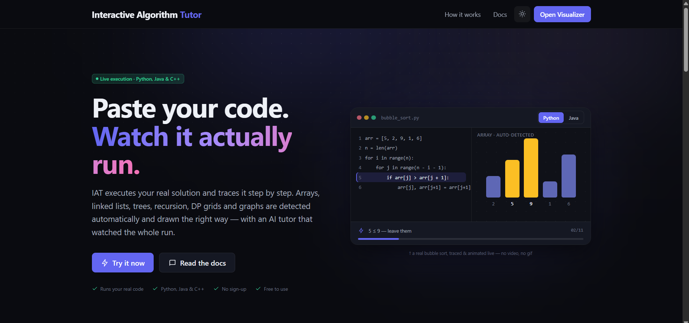
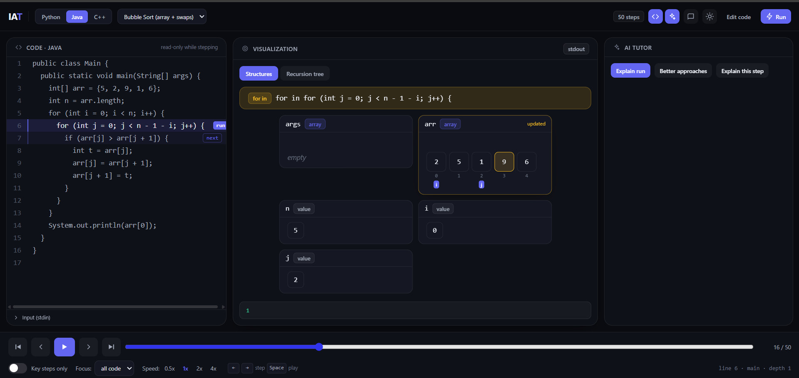
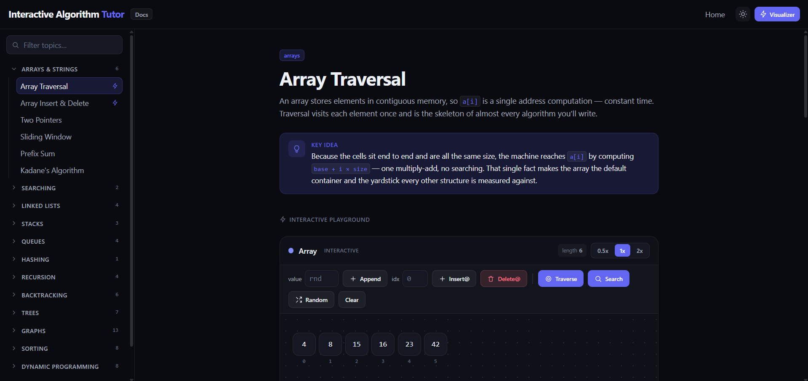

<a href="https://interactive-algorithm-tutor.vercel.app">
  
</a>

# Interactive Algorithm Tutor

### **[interactive-algorithm-tutor.vercel.app](https://interactive-algorithm-tutor.vercel.app)**

Paste real Python, Java, or C++ code, run it for real, and watch the correct
visualization appear automatically — arrays, linked lists, trees, recursion
trees, DP grids, stacks/queues, graphs, and tries. Every step comes from an
actual execution trace (Python `sys.settrace`, Java JDI, C++ via `gdb`) —
nothing is guessed or hard-coded per example.

## Quick look

| | |
|---|---|
|  |  |
| Landing page | Visualizer — live Java trace, step-by-step |


<p align="center"><em>70+ written articles with interactive playgrounds for every topic</em></p>

## What it does

- Runs your code in the selected language and captures a full step-by-step
  execution trace (variables, call stack, loop/branch state).
- Automatically detects the data structures involved and renders the right
  visualization for each one — no manual configuration.
- Timeline scrubber with play/pause/speed, "key steps only" mode, and
  per-function focus for deep call stacks.
- 70+ written articles covering the underlying algorithms and data structures,
  plus 40+ ready-to-run premade visualizations.

## Architecture

```
React frontend (Vite)  --HTTPS-->  Node gateway  --localhost-->  Python worker   (sys.settrace)
                                                  --localhost-->  Java worker     (JDI)
                                                  --localhost-->  C++ worker      (gdb)
```

The frontend is a static Vite/React app deployed on Vercel. The gateway and
the three language workers run together on a single backend host and are
process-managed with `pm2`.

## Getting started locally

Requires **Python 3.10+**, **Node 18+**, and a **JDK 11+** on PATH.

```
cd backend
pip install -r requirements.txt
uvicorn worker.app:app --host 127.0.0.1 --port 8000     # Python worker

cd backend/java-worker
java JavaWorker.java --serve 8001                        # Java worker

cd backend/cpp-worker
uvicorn app:app --host 127.0.0.1 --port 8002              # C++ worker (needs g++/gdb)

cd backend/Api
npm install && npm start                                  # Gateway, http://localhost:5000

cd frontend
npm install && npm run dev                                # http://localhost:5173
```

On Windows, `start-all.bat` / `start-all.ps1` launch all of the above in one
step.

## Deployment

Frontend is deployed on Vercel, built from `frontend/`. The backend runs on a
Linux VM behind Caddy (automatic HTTPS), with `VITE_API_URL` pointing the
frontend at the backend's URL.
